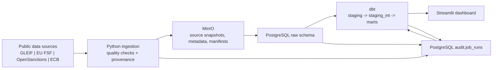

# Architecture

## Purpose and scope

EntityRisk Navigator is an educational counterparty-risk data pipeline. It ingests public entity, relationship, sanctions, and macroeconomic data; retains source snapshots and provenance; transforms the data into PostgreSQL marts; and exposes the results through a Streamlit dashboard.

This document describes the implemented repository architecture. FastAPI and Neo4j are mentioned as planned components in the README, but are not part of the implemented runtime architecture.

## System context



## Runtime components

| Component | Responsibility | Implementation |
| --- | --- | --- |
| PostgreSQL | Warehouse and operational audit store | Docker service `postgres`; schemas include `raw`, `staging`, `marts`, `audit`, and dbt seed schema `config` |
| MinIO | S3-compatible immutable-ish bronze/raw storage for downloaded files, metadata, and manifests | Docker service `minio`; configured bucket is `counterparty-risk-bronze` |
| Ingestion container | Runs Python download, raw-load, and dbt-runner modules | Docker service `ingestion`; project source is mounted at `/app` |
| dbt | SQL transformation and test framework | PostgreSQL profile `entity_risk_postgres`; models under `dbt/models` |
| Streamlit | Dashboard for risk overview, entity detail, pipeline status, and macro environment | Docker service `dashboard`, port `8501` |
| Audit subsystem | Structured job history, data freshness, row counts, failures, and pipeline health | `audit.job_runs` plus `marts.mart_pipeline_audit_status` |

PostgreSQL is exposed on port `5432`. MinIO exposes its API on port `9000` and console on port `9001`. All services communicate over the Docker bridge network `entity_risk_network`.

## Data layers

| Layer | Purpose | Examples |
| --- | --- | --- |
| MinIO bronze | Original downloaded objects, per-file metadata, and run manifests | GLEIF ZIP snapshots; ECB CSV responses; SHA-256 and source URL metadata |
| `raw` | Typed, loadable copies of source records | `raw.gleif_lei_full`, `raw.eu_fsf_full`, `raw.opensanctions_targets`, `raw.ecb_observations_full` |
| `staging` | Source-aligned normalization and intermediate business preparation | GLEIF entities and relationships; sanctions subjects and names |
| `marts` | Dashboard-facing entity, screening, relationship, macro, and audit outputs | `mart_entity_master`, `mart_entity_risk_score`, `mart_pipeline_audit_status` |

The current entity population is GLEIF-based. Sanctions outputs are screening signals generated from normalized names and contextual checks; they are not legal determinations.

## Repository structure

```text
entity-risk-navigator/
├── src/
│   ├── common/          # HTTP, MinIO, PostgreSQL, audit, manifest, and dbt-runner utilities
│   ├── ingestion/       # GLEIF, EU FSF, OpenSanctions, ECB, and BaFin download modules
│   ├── loading/         # MinIO snapshot to PostgreSQL raw loaders
│   ├── staging/         # Audited staging dbt runner
│   ├── staging_int/     # Audited intermediate dbt runner
│   └── mart/            # Audited mart dbt runner
├── dbt/
│   ├── models/          # SQL models grouped into staging, staging_int, and marts
│   ├── macros/          # Shared dbt SQL helpers
│   └── seeds/           # Expected-table configuration for pipeline monitoring
├── scripts/             # Raw, dbt, and end-to-end pipeline entry points
├── streamlit_app/       # Dashboard application, pages, database access, and SQL queries
├── docker/              # PostgreSQL initialization mount point
├── docs/                # Project documentation
├── docker-compose.yml   # Local runtime topology
└── requirements.txt     # Ingestion and transformation dependencies
```

## Deployment and scheduling

The repository provides shell entry points but no scheduler configuration. Operations trigger `scripts/run_full_pipeline.sh` once daily through an externally managed cron job. The script executes raw ingestion/loading followed by dbt transformation, tests, audit-mart refresh, and dashboard restart.

BaFin scraping code exists as an optional, candidate-driven enrichment path. Its staging table is inactive in the expected-table seed and it is not called by the standard raw-load script.

## Audit and observability

Every download, raw load, and dbt model run creates a row in `audit.job_runs`. The record captures job identity, source and target, timestamps, status, source/manifest references, freshness, processed files, row counts, byte counts, warnings, errors, and structured metadata.

The mart `marts.mart_pipeline_audit_status` presents the latest run for each `(job_name, target_table)` along with run history. Pipeline status should be assessed from both health and freshness:

| Signal | Meaning | Operational interpretation |
| --- | --- | --- |
| `healthy` | Latest run is `success` or `success_with_warnings` | Pipeline step completed; inspect warnings where applicable |
| `latest_failed_previous_success_available` | Latest run failed or remained incomplete, but an earlier successful output exists | Serviceable historical output, but investigate and rerun the failed step |
| `not_healthy` | Latest run failed/incomplete and no prior success exists | Output is unavailable or untrusted; remediate before use |
| `fresh` | Latest inherited source snapshot is fresh | Source age is within the loader's configured policy |
| `stale` | At least one upstream source is stale | Output may be complete but based on aged source data |
| `unknown` | Freshness cannot be established from upstream audit records | Verify the relevant source and audit history |

The dashboard's Pipeline Status page reads the audit mart and the expected-table seed to show missing, failed, warning, and healthy tables. `error_message`, `last_failure_at`, `last_success_at`, `rows_read`, `rows_inserted`, `snapshot_age_days`, and the manifest/object references provide the first diagnostic path.
