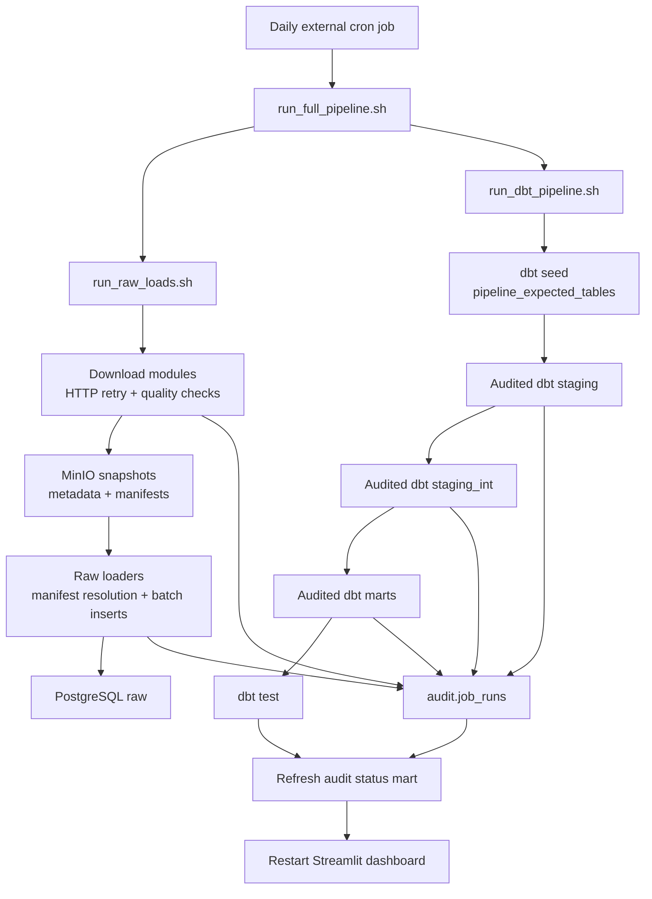

# Pipeline Design

## Purpose

The pipeline builds dashboard-ready counterparty-risk context from public entity, relationship, sanctions, and macroeconomic sources. It follows an ELT design: source snapshots are downloaded and retained first, loaded into PostgreSQL raw tables, transformed with dbt, and exposed through Streamlit.

## Scheduling and entry points

An externally managed cron job triggers the end-to-end pipeline once per day. The repository does not contain the cron definition; its scheduled command is expected to invoke:

```bash
./scripts/run_full_pipeline.sh
```

| Script | Responsibility |
| --- | --- |
| `scripts/run_raw_loads.sh` | Starts required services, downloads active source data to MinIO, and loads it into PostgreSQL raw tables |
| `scripts/run_dbt_pipeline.sh` | Seeds pipeline expectations, executes auditable dbt model runners, runs dbt tests, refreshes the audit mart, and restarts the dashboard |
| `scripts/run_full_pipeline.sh` | Runs raw loads followed by the dbt pipeline; shell strict mode stops the sequence when a command fails |

The standard raw-load sequence is ECB, EU FSF, OpenSanctions, then GLEIF. BaFin is not part of this sequence.

## End-to-end flow



## Ingestion and raw loading

Each downloader validates environment configuration, opens an audit run, retrieves the configured source through `HttpDownloader`, executes source-specific quality checks, and uploads the source object to MinIO. It stores per-file metadata and a run manifest containing source URL, object keys, hash, size, checks, and status.

Raw loaders resolve the latest successful source manifest, stream or parse the referenced object, map source columns, and insert records in batches into the appropriate raw table. The loaders write source and object references, effective load date, row counts, and freshness information to the audit record. Loaders can apply a configured stale-snapshot policy.

| Source | Download module | Raw-load module | Raw tables |
| --- | --- | --- | --- |
| ECB | `ingestion.download_ecb` | `loading.load_ecb_raw_v1` | `raw.ecb_observations_full` |
| EU FSF | `ingestion.download_eu_fsf_csv` | `loading.load_eu_fsf_raw_v1` | `raw.eu_fsf_full` |
| OpenSanctions | `ingestion.download_opensanctions` | `loading.load_opensanctions_raw_v1` | `raw.opensanctions_targets` |
| GLEIF | `ingestion.download_gleif` | `loading.load_gleif_raw_v1` | `raw.gleif_lei_full`, `raw.gleif_rr_full` |

## Transformation design

dbt models are executed one at a time by audited Python runners. Each runner records a `running` audit row, calls `dbt run --select <model>`, obtains the target row count, derives inherited freshness from upstream audit records, and finalizes the audit row.

### Staging

The staging layer standardizes source-specific raw data:

- GLEIF LEI and relationship records become normalized entity and relationship inputs.
- EU FSF becomes structured sanctions records.
- OpenSanctions becomes standardized target records.
- ECB observations become standardized macro inputs.

### Intermediate layer

The intermediate layer creates GLEIF entity candidates and parent summaries; separates sanctions subjects and names for EU FSF and OpenSanctions; unifies these two sanctions source views; and produces entity-to-sanctions matches.

The match pipeline currently uses exact normalized name keys. It adds match-quality context, including whether the key is short or generic and whether country or identifier overlap exists. Match tiers are `high_confidence`, `medium_confidence`, and `review_required`.

### Marts

| Mart | Purpose |
| --- | --- |
| `mart_entity_master` | GLEIF-based entity master enriched with parent information |
| `mart_entity_sanctions_screening` | One record per entity-to-sanctions screening match |
| `mart_entity_risk_score` | Entity-level aggregation of match quality into risk score and tier |
| `mart_entity_relationship_edges` | Parent relationship edges |
| `mart_entity_parent_paths` | Parent path information |
| `mart_entity_relationship_context` | Dashboard-ready relationship context |
| `mart_ecb_macro_timeseries` | Standardized ECB series with derived time-series context |
| `mart_ecb_macro_pressure_score` | Macro-pressure score derived from the ECB mart |
| `mart_entity_macro_context` | Entity-level macro context using jurisdiction applicability |
| `mart_pipeline_audit_status` | Latest audit outcome and run history for monitored pipeline steps |

## Testing, failure behavior, and recovery

The shell scripts use `set -euo pipefail`; a non-zero command ends that script. The dbt pipeline runs `dbt test` after transformations. A failed model invocation is recorded in `audit.job_runs` with `status='failed'` and its error text before the runner re-raises the failure.

The audit refresh occurs after dbt tests. Consequently, an operations run should treat a failed script or failed test as requiring investigation even when prior marts remain queryable. The next daily cron invocation is not a substitute for reviewing a current failure.

## Audit logging and pipeline health

`audit.job_runs` is the authoritative execution log. It stores the job identity and type, source, target system/table, environment, timestamps, status, manifest and source references, data freshness, file/row/byte metrics, warnings, errors, and JSON metadata.

`marts.mart_pipeline_audit_status` groups audit history by `job_name` and `target_table` and represents the latest run. Its health calculation is:

| Latest run condition | `pipeline_health_status` | Action |
| --- | --- | --- |
| `success` or `success_with_warnings` | `healthy` | Confirm freshness and review warnings if present |
| Failed or incomplete, with an earlier successful run | `latest_failed_previous_success_available` | Inspect `error_message`; previous output may be available, but rerun or repair the failed step |
| Failed or incomplete, with no earlier successful run | `not_healthy` | Treat the target as unavailable or untrusted; remediate before relying on it |

Freshness is a second, independent signal. For dbt models, it is inherited from latest successful upstream audit rows: any stale dependency makes the model `stale`; any unknown or missing dependency makes it `unknown`; only all-fresh dependencies yield `fresh`. `snapshot_age_days` is the maximum observed upstream age.

To assess daily pipeline health, use the Pipeline Status dashboard page or query `marts.mart_pipeline_audit_status` and check:

1. `pipeline_health_status` for `not_healthy` or `latest_failed_previous_success_available`.
2. `freshness_status` and `snapshot_age_days` for stale or unknown inputs.
3. `is_successful_latest_run`, `last_success_at`, and `last_failure_at` to establish recency and recovery state.
4. `error_message`, row counts, and manifest/object references to diagnose the failed or suspect step.

The expected-table seed (`config.pipeline_expected_tables`) defines active tables monitored by the dashboard. A monitored table without a corresponding audit result is displayed as `missing_run` by the dashboard query and should be investigated as an incomplete daily execution or configuration gap.
